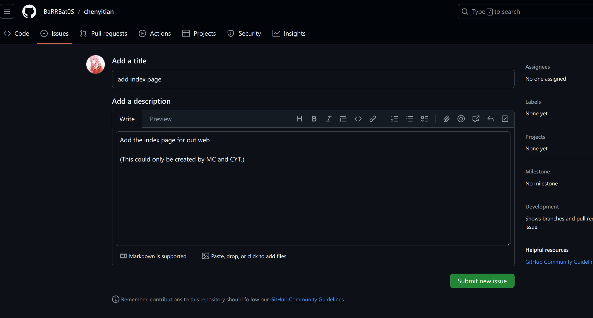
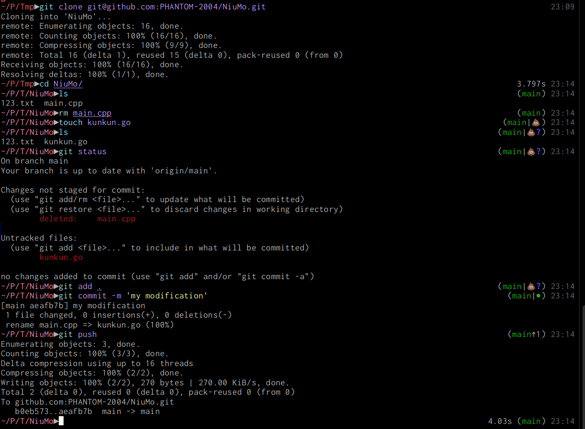

# 版本管理篇: git

## 开发流程

- 提出issue, 作为bug/enhancement. 
- 对应issue设置feature-x分支
- 对应issue提出pull request
- 上游负责人merge PR

- 首先，开发一个新功能前必须先撰写issue，内容采用feature模板，并对issue设置合理的Label (模块归属，讨论，ToDo等) 和计划的Due date（参考Milestone，可不完全一致）
- issue划分的参考准则是在较短的时间内<4周可完成的功能，较大的issue作为Epic或者进行拆分
- 其次，每周讨论将合理的issue分配到Doing并由Maintainer分配developer处理该issue
- Maintainer或者一名负责该issue的developer从该issue创建merge request或创建branch，并选择正确的目标分支 (develop)
    - merge request 会直接创建一个WIP merge request，并且创建一个该issue的远端分支，WIP表示该merge request还未完成
    - create branch 会创建一个该issue的远端分支
- 所有处理该issue的developer在本地创建该issue的远端分支的跟踪分支，直接在该分支上进行工作；或者继续创建该跟踪分支的子分支，完成子分支工作后merge到该跟踪分支上
- 完成工作后，maintainer负责处理该issue的merge request

### 提出issue
这里找了个仓库作为演示


通常来说, issue大家都可以提出, 但是我们提出issue一般都是商议好的. 这里的label只有maintainer可以添加. 会添加相应的label. 

> 目前仓库的结构还没有确定好, 初步有两种方式, 一种是我们前后端放到一个仓库, 前端就在前端分支开发, 后端就在后端的分支开发. 最后对接的时候合并.

> 另一种方案是前端作为后端的子仓库(submodule)进行管理, MHC负责前端仓库的PR. CYT负责后端仓库的PR

### 上游开启feature分支

上游maintainer(CYT和MHC), 建立对应issue的分支. 举个例子现在做一个index页面, 那么上游会开一个分支`feature-index`. 

### 提出PR

这部分比较关键, 希望大家详细理解, 不理解的自己开一个仓库试一试. 

#### Maintainer
对于maintainer来说, 开启`feature-x`上游分支, `maintainer`直接负责推送到这个分支即可. 
#### Others
- 对于非`maintainer`来说, 比如我们的仓库是`R`, 需要向`R`提出`pull request`, 在`github`的实现就是, 参与者`A`首先把代码仓库`fork`一份, `fork`得到的仓库是`RA`. 这一份`fork`就是参与者`A`的远程仓库, 参与者`A`提出`PR`的依据就是这份远程仓库. 
- 参与者`A`在自己本地修改, 然后把本地修改过的仓库推送到自己的`RA`上面. 具体来说就是, 你在本地`commit`几次感觉差不多之后. 
```shell
# origin就是RA仓库的而远程分支, 这里的意思就是把当前本地分推送到RA的xxx分支
git push origin xxx # 推送到xxx分支
# 实际上fork后默认有一个对应关系, 只需要git push就可以推送到自己仓库了
```
这样`A`的远程分支就和`A`本地的同步了. 

比如上面`clone`的这个仓库这是我们`fork`过来的仓库, 然后我们在我们自己的仓库改动, 然后推送到我们自己的分支(因为fork之后对应关系就是确定的, 推送到`fork`后的远程仓库)


- 接下来在`github`中, 用自己`fork`的仓库向我们主仓库的开的`feature-xxx`分支提出`PR`. 这个时候会自动检测, 是否可以合并. 
- 第一种情况, 如果检测成功就是绿色的, 如下图.

查看检查的结果: 

这种情况就直接推送就可以, 就发起了一次`PR`. 当然实际开发过程中我们并不是对于`main`提出`PR`, 注意自己选择推送的分支.

- 我们看第二种情况, 就是不能自动合并


这时仍然可以提出`PR`, 可以交给上游开发者进行合并. 但是我们作为开发者应当主动避免冲突, 避免让上游开发者合并. 所以说有问题可以微信提前沟通一下. 同时还需要保证自己的分支和我们主仓库的对应分支是同步的, 也就是说需要及时pull

<u>注意你的冲突处理! 不要每次都交给maintainer. 见下一小节</u>.
#### 和上游保持同步

> 注意, 每次开发提前一定要拉取最新更新. 跟随如下步骤

1. 把主仓库对应的分支添加到远程分支中


可以看到, 我们这里多出了主仓库对应的远程分支. 

2. 每次开发前注意拉取远程主仓库对应分支的更新: 注意我们图片的这句话的意思
```shell
git pull xiaoqing main#指定远程分支xiaoqing 的main分支, 和上游分支保持同步
```
通常来说这一步就没问题了, 但是有时候也难免出现冲突, 这很正常. 

看这个图, 我们对上游主仓库`pull`发现不能直接拉取, 因为有冲突, 这时候我们选择冲突的处理方式. 我们统一使用merge处理冲突. 注意这一句`git config`然后再`pull`

3. 有冲突怎么办? 我们发现拉取主仓库的合并中的出现冲突, 具体什么冲突呢? 

原来是`main.cpp`的冲突. 接下来我们看`main.cpp`的内容

圈出来的这三行是自动生成的, 需要合并的时候删掉. 
上面是我们本地的HEAD, 下面是远程的对应commit. 中间是分隔符. 
如果解决冲突, 比如我们保留一部分远程的, 一部分我们自己的(<u>当然通常来说, 我们应当保留远程分支已有的代码, 不要擅自删掉, 而是只增加自己的)</u> .
如果按照这里的例子, 想要增加一些同时删掉一些就改成下面这样:

- 然后加入到暂存区并且提交: 

- 之后就是提出`PR`了

***为什么刚刚冲突了呢 ?*** 看下图:

> 这两位作者都在提交的时候`add`了`main.cpp`. 我们刚刚提交的就是最新的那一条合并记录. 

